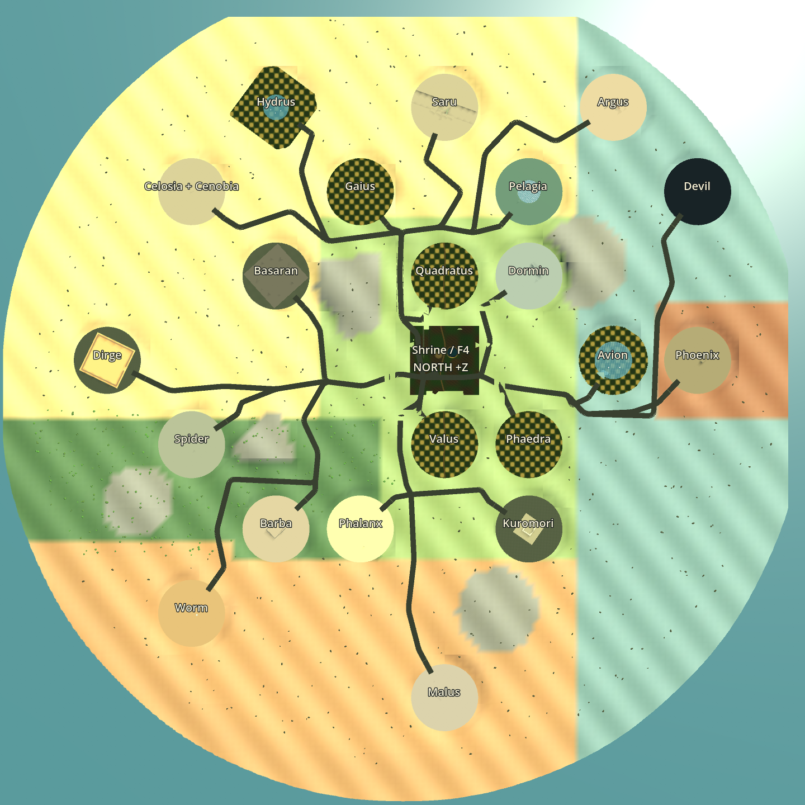
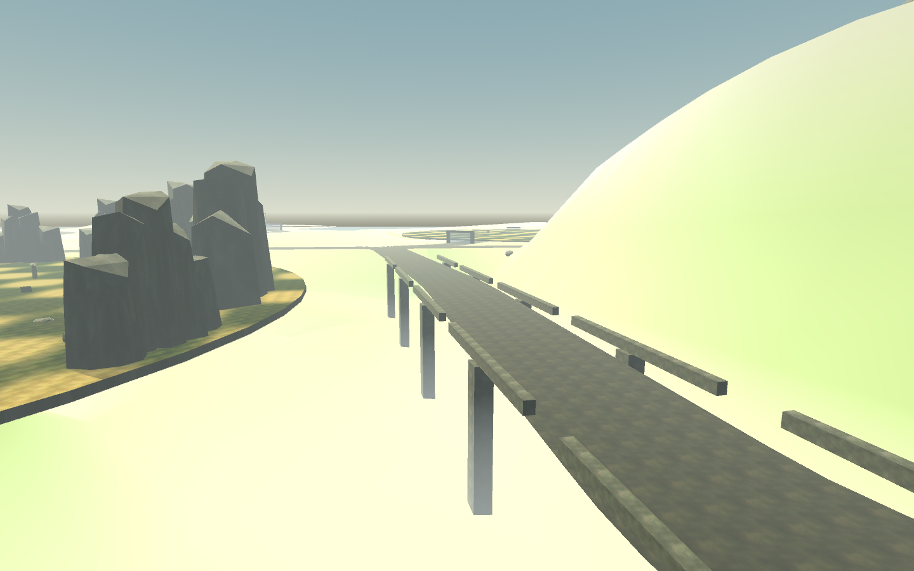
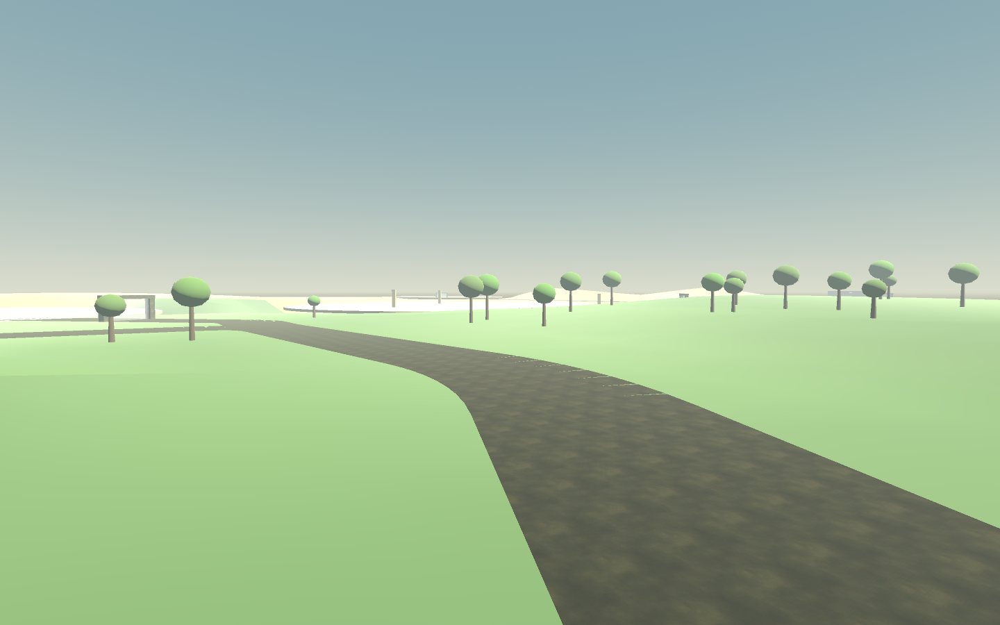

# Kraina Zakazana — orientacyjny układ 3

Układ 3 to nasz teren i nasze połączenia regionów, inspirowane geografią *Shadow of the Colossus*. Nie jest rekonstrukcją 1:1. Zachowuje rozpoznawalne sąsiedztwo aren i główne biomy; skala, zakręty, rozgałęzienia, most oraz dodatkowe regiony są autorskie. Nie skopiowano geometrii ani tekstur z oryginalnej gry lub map referencyjnych.

Północ leży w kierunku **+Z**, wschód w **+X**. Świątynia jest środkiem F4. Jedna komórka odniesienia odpowiada umownie 440 m. Północny szlak prowadzi przez most nad rzeczywistym obniżeniem terenu, zachodnie gałęzie przez kaniony i pustynne kotliny, południowo-zachodnie przez las i ruiny, wschodnie do jezior i wodospadów, a południowy trakt do cytadeli Malusa. Finał Dormina ma osobną kaplicę przy świątyni, poza początkową doliną.

## Odniesienia obejrzane podczas przygotowania

- [Mapa topograficzna VGCartography](https://www.deviantart.com/vgcartography/art/Shadow-of-the-Colossus-Forbidden-Lands-World-Map-1046251268): obejrzano pełny obraz mapy. Pomaga rozdzielić kaniony, zachodnie pustynie, lasy oraz wschodnie jeziora; to ilustracja fanowska, więc nie służy jako pomiar terenu. Strona DeviantArt zwracała 403, dostępny był obraz referencyjny.
- [Poradnik Push Square z mapami i kierunkami dojścia](https://www.pushsquare.com/news/2020/03/guide_shadow_of_the_colossus_ps4_boss_guide_-_how_to_find_and_kill_all_16_colossi): przeczytano trasy i obejrzano faktyczny zrzut mapy PS4. [Obejrzany zrzut](https://images.pushsquare.com/7672a929618fd/where-to-find-colossus-11-shadow-of-the-colossus-guide.large.jpg) pokazuje świątynię, most oraz położenia szesnastu starć.
- [Mapa siatki z oznaczeniami wszystkich kolosów](https://h1g.jp/wander/%E3%83%AF%E3%83%BC%E3%83%AB%E3%83%89%E3%83%9E%E3%83%83%E3%83%97): obejrzano [obraz siatki](https://da9v1g7imu10q.cloudfront.net/images/wander/e/ea/Map.jpg) i odczytano poniższe orientacyjne komórki.
- [Nomad — unused/beta colossi](https://nomads-sotc-blog.blogspot.com/2011/07/unusedbeta-colossi.html): przeczytano artykuł wraz z późniejszym zastrzeżeniem autora. Autor wycofuje wiele dawnych hipotez o lokacjach; między innymi starsze przypisanie Phoenixa do D3 uznaje za błędne i opisuje późniejsze odniesienie do krateru I4. Nasze miejsca dla dodatkowych przeciwników pozostają decyzją projektową, a nie deklaracją odzyskania historycznych aren.

[Neoseeker](https://shadowofthecolossus.neoseeker.com/wiki/The_Colossi) i [Team Ico Wiki](https://teamico.fandom.com/wiki/Unused_Locations_%28Shadow_of_the_Colossus%29) blokowały odczyt (403); ich treści nie wykorzystano jako sprawdzonych faktów.

## Rozmieszczenie

| Starcie | Odniesienie | Środek X, Z (m) | Region |
|---|---|---:|---|
| Valus | F5 | 0, −440 | południowe urwiska |
| Quadratus | F3 | 0, 440 | północny kanion |
| Gaius | E2 | −440, 880 | zachodnie wyżyny |
| Phaedra | G5 | 440, −440 | wschodnie łąki |
| Avion | H4 | 880, 0 | wschodnie jezioro |
| Barba | D6 | −880, −880 | leśny grobowiec |
| Hydrus | D1 | −880, 1320 | północne jezioro |
| Kuromori | G6 | 440, −880 | południowe ruiny |
| Basaran | D3 | −880, 440 | zachodnie gejzery |
| Dirge | B4 | −1760, 0 | zachodnia jaskinia |
| Celosia + Cenobia | C2, wspólna arena | −1320, 880 | zespół zachodnich ruin |
| Pelagia | G2 | 440, 880 | wschodnie wodospady |
| Phalanx | E6 | −440, −880 | południowa pustynia |
| Argus | H1 | 880, 1320 | północna forteca |
| Malus | F8 | 0, −1760 | południowa cytadela |
| Devil | **nasze rozszerzenie I2** | 1320, 880 | wschodnia jaskinia |
| Phoenix | **nasz krater I4** | 1320, 0 | wschodni krater |
| Spider | **nasze rozszerzenie C5** | −1320, −440 | leśne ruiny |
| Worm | **nasze rozszerzenie C7** | −1320, −1320 | zachodnie wydmy |
| Saru | **nasze rozszerzenie F1** | 0, 1320 | zniszczone mosty |
| Dormin | **nasza kaplica G3** | 440, 440 | aneks świątyni |

Celosia w oryginale ma oddzielną arenę F1, a Cenobia C2. W naszej kampanii walczą razem w C2, zgodnie z przyjętym projektem jednego starcia przeciw dwóm strażnikom. Dzięki temu F1 może służyć autorskiemu regionowi Saru.

## Połączenia i zapis

Trasy mają wspólne pnie i rozgałęzienia, zaokrąglone zakręty oraz różną długość. Bramy stoją 220 m od środka konkretnej areny; ostatni odcinek jest prosty i prowadzi przez obrzeże 170 m do lokalnego +Z=145 m. Każda arena zachowuje dysk o promieniu 175 m i własną orientację mechanik.

Wskazanie miecza i bot podróżny wyznaczają kolejny odcinek na podstawie obecnej pozycji. Nie ma osobnego kursora trasy, który mógłby się rozminąć z checkpointem. Teren i nazwy jego statycznych podpór są odtwarzane deterministycznie; pozycja, ruch Agro i postęp kampanii pozostają w normalnym binarnym zapisie świata.

Układy 1 i 2 nadal używają swoich dotychczasowych transformacji, bram i podłóg. Starsze nagrania oraz checkpointy zachowują wersję układu. Integracja głównej sceny wybiera układ 3 dla nowej gry, a Continue odtwarza numer zapisany w istniejącej grze.

Kolizje podróżnego terenu powstają na początku, a drobne dekoracje regionów przyrastają kolejką po jednym fragmencie na klatkę. Teren nie dodaje kolizji na drzewach i kamieniach przy drogach. Dno otoczenia obniża się pod arenami, aby nie wypełniało ich jezior ani przepaści zagadek.

## Podgląd i walidacja

Test `tests/forbidden_lands.tscn` sprawdza dawne układy, odstępy aren, wszystkie 21 tras, fizyczną podłogę w trzech pasach i rzeczywistą jazdę Agro ze świątyni do obrzeży aren. Wyniki znajdują się w `tests/output/forbidden_lands.json`. Kadry terenu i mapy są renderowane z rzeczywistych węzłów gry, nie z obrazu referencyjnego.

**Wynik końcowy 3 października 2026: PASS, exit 0, 0 błędów.** Wszystkie **21/21 fizycznych przejazdów** ukończono na Agro przez PlayerActions, bez teleportowania, śmierci i stallów. Sprawdzono **4269 próbek podłogi** z tym samym wyłączeniem tylnych ścian trójkątów, którego używają Agro i wspinaczka. Najkrótszy odcinek ma 334,3 m, najdłuższy 2416,4 m; suma 21 tras wynosi 29,42 km. Minimalny odstęp środka drogi od krawędzi obcej areny wynosi 43,46 m, przy połowie szerokości drogi 14 m. Areny nie nakładają się na siebie ani na początkową dolinę.

Przejazdy zajęły łącznie 3596,7 s symulacji; pojedynczo 54,3–295,1 s. Cały ostatni test zakończył się po **217 600 tickach i 216,2 s czasu ściennego**, zapisując `completed=true`. Test dodatkowo fizycznie opuścił arenę Valusa przez bramę i ponownie do niej wjechał. Na północnej gałęzi Hydrusa zapisano i odczytano binarny checkpoint **53 840 B** w pozycji X=−233,279, Z=482,729 m: zachował Agro, jeźdźca, numer układu i przebyty odcinek, po czym dojechał do areny. Kontrola transformacji dawnych układów 1 i 2 przeszła.

Polecenie pełnego testu:

```bat
python tools\run_local.py godot --headless --fixed-fps 60 --quit-after 660000 tests/forbidden_lands.tscn
```

Test sam kończy się błędem przy niedotarciu w 460 s, dłuższym postoju lub globalnym przekroczeniu 600 000 ticków / 15 minut czasu ściennego. Zewnętrzne `--quit-after 660000` zostawia margines po własnym watchdogu; samo wymuszone zakończenie Godota nie jest uznawane za dowód ukończenia tras.

Render Compatibility/OpenGL 3.3 przeszedł bez błędów i ostrzeżeń. W ostatnim pomiarze uruchomienie rzeczywistego GameWorld z grafiką trwało **2,33 s** na stanowisku z RX 7900 XTX; jest to pomiar lokalny, nie wynik na karcie sprzed 13 lat. Kolejka zawiera **256 małych zadań**, największe zmierzone trwało **1,56 ms**. Teren ma **256 przestrzennych chunków**, drogi **66 chunków wizualnych**, a detale **940 małych meshy**. Natywne culling odcina teren i drogi poza 1100 m, drzewa poza 360 m, kamienie poza 450 m. Meshe te nie rzucają cieni; teren używa jednego materiału z kolorami wierzchołków, bez dodatkowej tekstury. Statyczne kolizje pozostają dostępne niezależnie od widoczności.

Mapa dokumentacyjna pokazuje wszystkie regiony i ma północ na górze, wschód po prawej; podpisy istnieją tylko w scenie capture. Kadry z perspektywy przywracają normalne limity widoczności. Oprawa regionów jest pierwszą wersją: proste bryły terenu i drzew, istniejące areny oraz przestrzeń pod przyszły detal.






